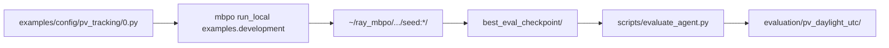

# Model-Based Policy Optimization (MBPO) — PV solar tracking

This repository trains a **model-based RL agent** to control a **two-axis solar tracker** in a **pvlib** simulator (`PVTracking-v0`). Training uses **MBPO** (ensemble dynamics + SAC). Evaluation compares the learned policy to simple baselines on the **same UTC episode grid** as training.

**Companion docs**

| Document | Contents |
|----------|----------|
| [docs/PV_TRACKING_TIME_AND_CHECKPOINTS.md](docs/PV_TRACKING_TIME_AND_CHECKPOINTS.md) | UTC daylight grid, checkpoint protocol, eval commands |
| [docs/PV_TRACKING_OBSERVATION_REVIEW.md](docs/PV_TRACKING_OBSERVATION_REVIEW.md) | Legacy 15-D vs physical 11-D observations |

**Table of contents**

1. [What this project does](#1-what-this-project-does)
2. [Repository layout](#2-repository-layout)
3. [Episode MDP](#3-episode-mdp-current-standard)
4. [Installation](#4-installation)
5. [Complete step-by-step procedure](#5-complete-step-by-step-procedure)
6. [Evaluation outputs](#6-evaluation-outputs-essential-vs-optional)
7. [Scripts directory (reference)](#7-scripts-directory)
8. [Configuration reference](#8-configuration-reference)
9. [Evaluation directory policy](#9-evaluation-directory-policy)
10. [Quick command reference](#10-quick-command-reference)
11. [Extending to other environments](#11-extending-to-other-environments)

---

## 1. What this project does

- **Simulates** irradiance and panel power with pvlib at **35°N, 106°W** (configurable in `mbpo/env/pv_tracking.py`).
- **Trains** on random calendar days in 2020 with stochastic weather (`weather_source='random'`).
- **Acts** with 2-D continuous commands: tilt and azimuth rate limits per 15-minute step.
- **Optimizes** per-step reward: collected energy minus a movement penalty.
- **Evaluates** with deterministic rollouts, optional baselines (`fixed_no_motion`, `sun_tracking`), CSV logs, and summary plots.

**Primary metric for reporting:** `total_energy_kwh` per episode (not peak step reward).

---

## 2. Repository layout

### 2.1 Source code (keep)

| Path | Role |
|------|------|
| `mbpo/env/pv_tracking.py` | Gym environment, pvlib, reward, `info` timestamps |
| `mbpo/static/pv_tracking.py` | MBPO termination + cyclic obs normalization |
| `mbpo/algorithms/mbpo.py` | MBPO training loop |
| `examples/config/pv_tracking/0.py` | Training hyperparameters + env kwargs |
| `examples/development/main.py` | Ray Tune entrypoint |
| `examples/development/base.py` | Variant builder; `MAX_PATH_LENGTH_PER_DOMAIN['PVTracking']` |
| `scripts/` | Health checks, training plots, evaluation (see §7) |
| `docs/` | Time standard, observation notes |

### 2.2 Generated artifacts (not in git; safe to delete and regenerate)

| Path | Produced by |
|------|-------------|
| `~/ray_mbpo/PVTracking/pv_tracking/seed:*/` | `mbpo run_local` — checkpoints, `progress.csv`, `params.json` |
| `evaluation/<run_name>/` | `scripts/evaluate_agent.py`, `compare_baselines.py` |

### 2.3 Training → evaluation data flow



---

## 3. Episode MDP (current standard)

All training, evaluation, baselines, and plots share **one** time definition. There is **no** civil-time conversion layer.

| Setting | Value |
|---------|--------|
| `tz` | `UTC` |
| `start_time` | `13:30` |
| `periods` | `40` (timestamps) |
| `freq` | `15min` |
| Env steps per episode | **39** (`periods - 1`) |
| Clock span | **13:30 → 23:15 UTC** on the episode date |
| Site default | 35°N, 106°W, 1600 m |
| Policy observations | **11-D physical** (`observation_mode='physical'`) |

**Why this grid:** At this latitude, `06:00–21:45 UTC` put ~half of winter steps in night (zero power). The daylight window keeps almost all steps in sun; expect **0–2** gray-band steps at the start in December (pre-sunrise). GHI peak on the grid is typically near **17–20 UTC** (solar noon at this longitude).

**Changing** `start_time`, `periods`, or `tz` defines a **new MDP** → retrain and re-evaluate. Old checkpoints are not comparable.

**Align these when changing horizon:**

- `environment_kwargs.periods` → `epoch_length = periods - 1`
- `examples/development/base.py` → `MAX_PATH_LENGTH_PER_DOMAIN['PVTracking']`
- Evaluation → `--max-path-length` = same step count

---

## 4. Installation

```bash
git clone --recursive https://github.com/jannerm/mbpo.git
cd mbpo
conda env create -f environment/gpu-env.yml
conda activate mbpo
pip install -e viskit
pip install -e .
```

MuJoCo is **not** required for PV tracking (only for classic MBPO benchmarks).

---

## 5. Complete step-by-step procedure

This section is the **main operator guide**: what to run, in what order, what each step produces, and how to know it succeeded. All commands assume:

```bash
conda activate mbpo
cd mbpo   # repository root (where `mbpo/` package and `scripts/` live)
```

### Phase overview

| Phase | Goal | Main tools |
|-------|------|------------|
| **A** | Verify env, UTC grid, and that training config merges correctly | `verify_utc_uniformity.py`, `check_pv_env.py`, `verify_training_config.py`, `run_example_dry` |
| **B** | Train MBPO (hours) | `mbpo run_local` + `examples/config/pv_tracking/0.py` |
| **C** | Monitor training; confirm `params.json` | `plot_training_progress.py`, `tail progress.csv` |
| **D** | Hold-out evaluation vs baselines | `evaluate_agent.py` |
| **E** | Root-cause / tracking diagnosis | `diagnose_tracking.py` |

**Artifacts (not in git):**

- Training: `~/ray_mbpo/PVTracking/pv_tracking/seed:<id>_<timestamp><hash>/`
- Evaluation: `evaluation/pv_daylight_utc/` (canonical name for December hold-out)

---

### Step A1 — UTC and horizon audit

**Script:** `scripts/verify_utc_uniformity.py`  
**Purpose:** Confirms training env, eval scripts, and `examples/development/base.py` all use the same UTC daylight grid (**13:30–23:15**, **39** steps). Run after any change to `start_time`, `periods`, or `tz`.

```bash
python scripts/verify_utc_uniformity.py
```

**Pass:** last line is `ALL CHECKS PASSED`.

---

### Step A2 — Environment smoke test

**Script:** `scripts/check_pv_env.py`  
**Purpose:** One reset/step, checks observation size, action space, and that `action=[1,0]` moves tilt by `+max_delta_tilt` (5°).

```bash
python scripts/check_pv_env.py --observation-mode physical
```

**Pass:** `reset obs shape: (11,)`, `PVTracking environment checker completed successfully`.

Optional: validate random weather table consistency:

```bash
python scripts/check_pv_env.py --observation-mode physical --validate-weather
```

---

### Step A3 — Training config merge check (required before long runs)

**Script:** `scripts/verify_training_config.py`  
**Purpose:** Loads `examples/config/pv_tracking/0.py` through the **same merge path** as `mbpo run_local` and fails if critical hyperparameters or env kwargs differ from the file. Prevents training with stale domain defaults (e.g. 50 epochs instead of 250).

```bash
python scripts/verify_training_config.py --config examples.config.pv_tracking.0
```

**Pass:** `PASS — merged training variant matches examples.config.pv_tracking.0` and printed values include `n_epochs=250`, `min_alpha=0.12`, `exploration=2500`, `observation_mode='physical'`.

Legacy 15-D ablation config (only if you intentionally train with `power_norm` + time features):

```bash
python scripts/verify_training_config.py --config examples.config.pv_tracking.1
```

---

### Step A4 — Dry run (no learning)

**Command:** `mbpo run_example_dry`  
**Purpose:** Prints the full Ray variant spec without starting training. Confirms `config_version`, `n_epochs`, and env grid in the logged experiment config.

```bash
mbpo run_example_dry examples.development \
  --config=examples.config.pv_tracking.0 \
  --gpus=0 --trial-gpus=0 --cpus=2 --trial-cpus=1
```

**Pass:** log contains `start_time='13:30' periods=40 (39 steps)`, `observation_mode='physical'`, `n_epochs: 300`, `config_version: pv_tracking_v4_beat_sun_2026-05-24`.

**Optional (pvlib / MBPO schedule):**

```bash
python scripts/validate_pv_rollouts.py --config examples/config/pv_tracking/0.py
python scripts/solar_time_sanity.py --date 2020-12-21 --env-rollout
```

---

### Step B — Training

**Command:** `mbpo run_local`  
**Config:** `examples/config/pv_tracking/0.py` (production tracking config, `CONFIG_VERSION = pv_tracking_v2_2026-05-23`).

```bash
mbpo run_local examples.development \
  --config=examples.config.pv_tracking.0 \
  --gpus=0 --trial-gpus=0 \
  --cpus=4 --trial-cpus=2
```

**What happens each epoch**

1. Sample a random calendar day in `[start_date, end_date]` with `weather_source='random'`.
2. Panel starts at **30° tilt, 180° azimuth** (`randomize_initial_orientation=False` — matches eval).
3. Collect **39** real transitions (`epoch_length`).
4. Train ensemble dynamics; MBPO imagined rollouts (length ≤ 3); SAC updates.
5. In-env eval episodes; if `evaluation/return-average` improves → update `best_eval_checkpoint/`.
6. Every 5 epochs → `checkpoint_<epoch>/` and `latest_checkpoint/`.

**Ray output directory:**

```text
~/ray_mbpo/PVTracking/pv_tracking/seed:<id>_<timestamp><hash>/
├── params.json          # full variant (verify after start!)
├── progress.csv         # per-epoch metrics
├── best_eval_checkpoint/
├── checkpoint_5/, checkpoint_10/, ...
└── latest_checkpoint/
```

**Immediately after training starts — verify `params.json`:**

```bash
export TRIAL=$(ls -td ~/ray_mbpo/PVTracking/pv_tracking/seed:*/ | head -1)
export TRIAL="${TRIAL%/}"
python -c "
import json; v=json.load(open('$TRIAL/params.json'))
print('config_version', v.get('config_version'))
k=v['algorithm_params']['kwargs']
print('n_epochs', k['n_epochs'], 'min_alpha', k['min_alpha'], 'real_ratio', k['real_ratio'])
e=v['environment_params']['training']['kwargs']
print('obs', e['observation_mode'], 'rand_init', e['randomize_initial_orientation'])
"
```

**Expected:** `config_version pv_tracking_v4_beat_sun_2026-05-24`, `n_epochs 300`, `min_alpha 0.2`, `real_ratio 0.95`, `movement_penalty 5e-05`, `obs physical`, `rand_init False`.

**Do not** judge the agent from training-time eval alone; always run Phase D on hold-out dates.

---

### Step C — Monitor training and pick checkpoint

**Script:** `scripts/plot_training_progress.py`  
**Purpose:** Plots `progress.csv` (training return, eval return, α, model loss).

```bash
export TRIAL=$(ls -td ~/ray_mbpo/PVTracking/pv_tracking/seed:*/ | head -1)
export TRIAL="${TRIAL%/}"
export CKPT="$TRIAL/best_eval_checkpoint"

python scripts/plot_training_progress.py "$TRIAL"
tail -5 "$TRIAL/progress.csv"   # quick numeric check
ls "$TRIAL/best_eval_checkpoint/policy_weights.pkl"
```

| Checkpoint folder | When to use |
|-------------------|-------------|
| `best_eval_checkpoint/` | **Default** — best training-time `evaluation/return-average` |
| `checkpoint_<N>/` | Compare a specific epoch |
| `latest_checkpoint/` | Resume / debug only |

**Optional — rank checkpoints on hold-out energy** (slower; runs mini-eval per checkpoint):

```bash
python scripts/select_best_checkpoint.py "$TRIAL" \
  --deterministic \
  --compare-baselines \
  --fixed-eval-dates 2020-12-07,2020-12-14,2020-12-21,2020-12-28 \
  --num-rollouts 4 \
  --max-path-length 39
```

Use the printed “Recommended for reporting” path if it differs from `best_eval_checkpoint`.

---

### Step D — Post-training evaluation (hold-out)

**Script:** `scripts/evaluate_agent.py`  
**Purpose:** Load checkpoint, run deterministic rollouts, write summaries, CSV trajectories, plots, and optional baselines on the **same UTC MDP** as training.

**Required flags for comparable results:**

| Flag | Value | Why |
|------|-------|-----|
| `--max-path-length` | `39` | Must equal `periods - 1` |
| `--eval-protocol` | `inherit` | Same UTC 13:30–23:15 grid as training |
| `--deterministic` | on | Greedy policy for reporting |
| `--compare-baselines` | on | `fixed_no_motion` + `sun_tracking` |
| `--fixed-eval-dates` | December Mondays | Fair paired comparison |

**Canonical command (December hold-out):**

```bash
export TRIAL=$(ls -td ~/ray_mbpo/PVTracking/pv_tracking/seed:*/ | head -1)
export TRIAL="${TRIAL%/}"
export CKPT="$TRIAL/best_eval_checkpoint"

python scripts/evaluate_agent.py "$CKPT" \
  --outdir evaluation/pv_daylight_utc \
  --eval-protocol inherit \
  --max-path-length 39 \
  --num-rollouts 10 \
  --deterministic \
  --compare-baselines \
  --fixed-eval-dates 2020-12-07,2020-12-14,2020-12-21,2020-12-28
```

**Primary outputs** (open these first):

| File | What to read |
|------|----------------|
| `evaluation_summary.txt` | Mean **total_energy_kwh**, vs baselines |
| `eval_scenario_confirmation.txt` | Same seeds, dates, UTC grid |
| `reward_time_analysis.txt` | Peak power/reward by UTC hour |
| `evaluation_method_comparison.png` | Bar chart: learned vs baselines |
| `rollouts/rollout_*.csv` | Per-step tilt, actions, power, `clock_hour_utc` |
| `rollout_plots/rollout_*_combined.png` | 6-panel UTC time series |

**Other eval modes** (same `--eval-protocol inherit --max-path-length 39`): see [§5.4 Evaluation variants](#54-evaluation-variants) below.

---

### Step E — Tracking diagnosis (no retrain)

**Script:** `scripts/diagnose_tracking.py`  
**Purpose:** Reads eval CSVs; checks action-space implementation; compares learned vs sun tracker on tilt error, action magnitude, and energy; optionally reads `progress.csv` and `params.json`.

```bash
python scripts/diagnose_tracking.py \
  --eval-dir evaluation/pv_daylight_utc \
  --verify-env \
  --progress-csv "$TRIAL/progress.csv" \
  --trial-dir "$TRIAL"
```

**Outputs:**

- `evaluation/pv_daylight_utc/diagnostics/tracking_diagnosis.txt`
- `evaluation/pv_daylight_utc/diagnostics/plots/` (tilt vs zenith, action histograms)

**How to interpret (December hold-out):**

| Check | Good | Poor (needs config / obs change, then retrain) |
|-------|------|--------------------------------------------------|
| vs `fixed_no_motion` energy | Learned **>** ~0.70 kWh mean | Learned **<** fixed |
| vs `sun_tracking` energy | Approaching ~0.90+ kWh | Stuck ~0.65–0.77 while sun ~0.96 |
| Mean \|tilt − zenith\| | **< ~10°** | **~29°** (quasi-fixed at mount pose) |
| Action L1 / sun (productive steps) | **> 0.5** | **< 0.25** (tiny deterministic actions) |
| `alpha` at end of training | Stays **above** `min_alpha` longer | Pinned at `min_alpha` entire late training |

Example from a completed `pv_tracking_v2` run: energy **0.774** vs fixed **0.697** (pass), but tilt error **~29°** and action ratio **~0.18** vs sun (still not true tracking).

---

### 5.5 Troubleshooting

| Symptom | Likely cause | What to do |
|---------|--------------|------------|
| `params.json` has `n_epochs: 15` or old `min_alpha` | Training started without `--config=examples.config.pv_tracking.0` | Re-run Phase A3; always pass explicit `--config=...` |
| `verify_training_config.py` FAIL | `base.py` / config mismatch | Fix config file; re-run verify until PASS |
| Eval obs dim error | Checkpoint trained with `legacy` (15-D) vs `physical` (11-D) | Match `--observation_mode` in eval to checkpoint; see `evaluate_agent.py` message |
| High training eval, low hold-out energy | Training eval ≠ December hold-out protocol | Always run Phase D with `--fixed-eval-dates` |
| Learned beats fixed but not sun | Entropy collapse; quasi-fixed 30° pose | Read `diagnose_tracking.py` report; consider `config/1.py` legacy obs **only if** you choose to retrain |
| Ray connection closed | Stale Ray session | Restart training; `ray stop` if needed |

---

### 5.6 Health checks (dry runs) — summary table

Run **before** a long training job. None of these modify the codebase. Full script reference: [§7 Scripts directory](#7-scripts-directory).

**Minimum (run every time):**

| Check | Command | Pass criterion |
|-------|---------|----------------|
| UTC + horizon audit | `python scripts/verify_utc_uniformity.py` | `ALL CHECKS PASSED`; grid **13:30**, **40** periods, **39** steps |
| Env smoke test | `python scripts/check_pv_env.py --observation-mode physical` | Reset/step OK; obs dim **11** |
| Training config merge check | `python scripts/verify_training_config.py --config examples.config.pv_tracking.0` | `PASS — merged training variant matches ...` |
| Training wiring (no learning) | `mbpo run_example_dry examples.development --config=examples.config.pv_tracking.0 --gpus=0 --trial-gpus=0 --cpus=2 --trial-cpus=1` | Log shows `start_time='13:30' periods=40 (39 steps)` |

**Recommended when changing config or debugging pvlib:**

| Check | Command |
|-------|---------|
| MBPO schedule + env rollout | `python scripts/validate_pv_rollouts.py` |
| pvlib vs UTC grid | `python scripts/solar_time_sanity.py --date 2020-12-21 --env-rollout` |

**Optional (redundant with the two above):** `python scripts/audit_pv_workflow.py`

---

### 5.4 Evaluation variants

**Required for all variants:** `--max-path-length 39`, `--eval-protocol inherit`, `--deterministic` for reporting.

**Canonical output directory:** `evaluation/pv_daylight_utc` (December hold-out on UTC daylight grid).

#### Run type 1 — Standard hold-out (recommended)

Fixed December dates; learned policy + baselines; full reports and plots.

```bash
python scripts/evaluate_agent.py "$CKPT" \
  --outdir evaluation/pv_daylight_utc \
  --eval-protocol inherit \
  --max-path-length 39 \
  --num-rollouts 10 \
  --deterministic \
  --compare-baselines \
  --fixed-eval-dates 2020-12-07,2020-12-14,2020-12-21,2020-12-28
```

#### Run type 2 — Random days over the training year

```bash
python scripts/evaluate_agent.py "$CKPT" \
  --outdir evaluation/pv_random_2020 \
  --eval-protocol inherit \
  --max-path-length 39 \
  --num-rollouts 10 \
  --deterministic \
  --compare-baselines
```

#### Run type 3 — Hold-out date range (e.g. all of December)

```bash
python scripts/evaluate_agent.py "$CKPT" \
  --outdir evaluation/pv_holdout_dec2020 \
  --eval-protocol inherit \
  --max-path-length 39 \
  --num-rollouts 10 \
  --deterministic \
  --compare-baselines \
  --test-start-date 2020-12-01 \
  --test-end-date 2020-12-31
```

#### Run type 4 — Seasonal solstice / equinox dates

```bash
python scripts/evaluate_agent.py "$CKPT" \
  --outdir evaluation/pv_seasonal_2020 \
  --eval-protocol inherit \
  --max-path-length 39 \
  --num-rollouts 4 \
  --deterministic \
  --compare-baselines \
  --fixed-eval-dates 2020-03-21,2020-06-21,2020-09-22,2020-12-21
```

#### Run type 5 — Clearsky weather only

```bash
python scripts/evaluate_agent.py "$CKPT" \
  --outdir evaluation/pv_clearsky_holdout \
  --eval-protocol inherit \
  --max-path-length 39 \
  --num-rollouts 10 \
  --deterministic \
  --compare-baselines \
  --eval-weather-source clearsky \
  --fixed-eval-dates 2020-12-07,2020-12-14,2020-12-21,2020-12-28
```

#### Run type 6 — Baselines only (no neural policy forward pass)

```bash
python scripts/compare_baselines.py "$CKPT" \
  --outdir evaluation/pv_baselines_only \
  --eval-protocol inherit \
  --max-path-length 39 \
  --num-rollouts 10 \
  --deterministic \
  --fixed-eval-dates 2020-12-07,2020-12-14,2020-12-21,2020-12-28
```

#### Run type 7 — Regenerate one rollout figure from CSV

```bash
python scripts/plot_rollout_trajectory.py \
  --csv evaluation/pv_daylight_utc/rollouts/rollout_1.csv \
  --outdir evaluation/pv_daylight_utc/rollout_plots_replot
```

`plot_rollout_trajectory.py` produces a **simple** 4-panel plot. The **rich** 6-panel UTC plot (power, energy, tilt, azimuth, actions, reward + night bands) is written only by `evaluate_agent.py`.

---

## 6. Evaluation outputs (essential vs optional)

Each `evaluate_agent.py` run creates a directory (e.g. `evaluation/pv_daylight_utc/`).

### 6.1 Essential (keep one canonical run for papers / reports)

| Artifact | Role |
|----------|------|
| `evaluation_summary.txt` / `.json` | Mean reward, **total_energy_kwh**, movement, season breakdown |
| `eval_scenario_confirmation.txt` | Fairness: same dates, seeds, UTC grid, baselines |
| `reward_time_analysis.txt` | Peak power/reward UTC hours; solar-altitude aggregates |
| `evaluation_method_comparison.png` | Policy vs baselines (requires `--compare-baselines`) |
| `evaluation_reward_by_solar_altitude.png` | Physics windows (preferred for “midday sun”) |
| `rollouts/rollout_<n>.csv` | Per-step `clock_hour_utc`, `power_w`, `solar_altitude_deg`, actions |

### 6.2 Useful but regenerable

| Artifact | Notes |
|----------|--------|
| `evaluation_reward_by_time_window.png` | UTC clock bins on this grid |
| `evaluation_rewards.png` | Per-rollout reward bars |
| `evaluation_by_season.png` | Skipped with `--no-report-by-season` |
| `rollout_plots/rollout_<n>_combined.png` | Large; regenerable from CSV via `evaluate_agent.py` |
| `baseline_rollouts/**/*.csv` | Regenerable with `--compare-baselines` |

### 6.3 Plot interpretation (UTC only)

- X-axis: **`clock_hour_utc`** (post-step wall clock in UTC).
- Gray bands: **`solar_altitude_deg ≤ 0`** (night / below horizon).
- Peak power often near **17–20 UTC** in winter on this grid = solar noon at 106°W, not “evening” in local civil time.
- Do **not** use peak step reward as the main metric; use **total_energy_kwh**.

---

## 7. Scripts directory

All paths below are from the **repository root** (`cd mbpo`). Scripts are grouped by role in the PV workflow.

### 7.1 Summary table

| File | Role | Verdict |
|------|------|---------|
| `eval_utils.py` | Shared library (env build, CSV, plots, reports) | **Keep** — imported by eval scripts; not run directly |
| `pv_trial_paths.py` | Resolve `latest` Ray trial directory | **Keep** — library for plotting / checkpoint tools |
| `verify_utc_uniformity.py` | Pre-flight + post-change audit | **Essential** |
| `verify_training_config.py` | Merged Ray variant vs config file | **Essential** — run before every long train |
| `check_pv_env.py` | Env smoke test (obs, weather) | **Essential** |
| `diagnose_tracking.py` | Root-cause report from eval CSVs (action/tilt/energy) | **Essential** after eval |
| `evaluate_agent.py` | Full post-training eval + plots + CSV | **Essential** |
| `evaluate_agent_advanced.py` | Aligned learned vs baseline, mean±std bands, dashboard PDF | **Optional** — use after canonical `evaluate_agent.py` when comparing dynamics on one figure |
| `plot_training_progress.py` | Training curves from `progress.csv` | **Essential** |
| `select_best_checkpoint.py` | Rank checkpoints on hold-out energy | **Recommended** |
| `validate_pv_rollouts.py` | MBPO rollout schedule + env validation | **Recommended** |
| `solar_time_sanity.py` | pvlib / UTC grid diagnostics | **Recommended** |
| `compare_baselines.py` | Baselines only (no policy network) | **Optional** — subset of `evaluate_agent.py` |
| `plot_rollout_trajectory.py` | Re-plot one rollout CSV (4 panels) | **Optional** — `evaluate_agent.py` already writes richer 6-panel plots |
| `export_policy_weights.py` | Extract `policy_weights.pkl` from old `checkpoint.pkl` | **Optional** — only if a checkpoint lacks `policy_weights.pkl` |
| `audit_pv_workflow.py` | Combined physical-obs + FakeEnv smoke test | **Optional** — overlaps `check_pv_env` + `verify_utc_uniformity` |
| `evaluate_and_viskit.py` | Shell wrapper: eval + training plots + viskit | **Can remove** — duplicates README commands; prefer direct calls |
| `plot_ray_results.py` | Parse pasted Ray **status** text into PNG | **Can remove** — not part of PV train/eval; use `plot_training_progress.py` instead |

**Safe to delete from the repo (no impact on train/eval):** `evaluate_and_viskit.py`, `plot_ray_results.py`.  
**Keep but rarely run:** `export_policy_weights.py`, `audit_pv_workflow.py`, `plot_rollout_trajectory.py`.

---

### 7.2 Libraries (do not run directly)

#### `eval_utils.py`

- **Purpose:** Single implementation for evaluation env construction (`apply_pv_utc_schedule`), rollout CSV columns, aggregate plots, `eval_scenario_confirmation.txt`, `reward_time_analysis.txt`, UTC time windows.
- **Used by:** `evaluate_agent.py`, `compare_baselines.py`, `select_best_checkpoint.py`, `verify_utc_uniformity.py`, `solar_time_sanity.py`.
- **Do not delete.**

#### `pv_trial_paths.py`

- **Purpose:** Resolve `latest` or a path to a Ray folder `seed:…/` (must contain `params.json`).
- **Used by:** `plot_training_progress.py`, `select_best_checkpoint.py`.
- **Do not delete.**

---

### 7.3 Essential scripts

#### `verify_utc_uniformity.py` — UTC grid and horizon audit

Confirms `mbpo/env/pv_tracking.py`, config, `examples/development/base.py`, and eval scripts all agree on **13:30–23:15 UTC**, **39** steps, and plot axis = `clock_hour_utc`.

```bash
python scripts/verify_utc_uniformity.py
python scripts/verify_utc_uniformity.py --config examples/config/pv_tracking/0.py
```

Run after any change to `start_time`, `periods`, `epoch_length`, or `MAX_PATH_LENGTH_PER_DOMAIN`.

#### `verify_training_config.py` — config merge guard

Loads `examples.config.pv_tracking.0` (or `.1`) through `examples.development.get_variant_spec` and compares merged `algorithm_params.kwargs` and `environment_params.training.kwargs` to the config file. Catches training without `--config=...` or stale `base.py` defaults.

```bash
python scripts/verify_training_config.py --config examples.config.pv_tracking.0
python scripts/verify_training_config.py --config examples.config.pv_tracking.1
```

Exit code **0** = safe to start `mbpo run_local`.

#### `check_pv_env.py` — environment smoke test

One reset/step, observation size, optional weather-table check.

```bash
python scripts/check_pv_env.py --observation-mode physical
python scripts/check_pv_env.py --observation-mode physical --validate-weather
python scripts/check_pv_env.py --observation-mode physical --log-obs
```

Also verifies incremental action semantics: `action=[1,0]` → `+max_delta_tilt` degrees.

#### `diagnose_tracking.py` — low-performance root-cause report (no retrain)

Reads rollout CSVs from `evaluate_agent.py` output, verifies action-space implementation,
and compares learned vs `sun_tracking` on tilt error, action magnitude, and energy.

```bash
python scripts/diagnose_tracking.py \
  --eval-dir evaluation/pv_daylight_utc \
  --verify-env \
  --progress-csv "$TRIAL/progress.csv" \
  --trial-dir "$TRIAL"
```

| Option | Purpose |
|--------|---------|
| `--eval-dir` | Folder with `rollouts/` and `baseline_rollouts/` from `evaluate_agent.py` |
| `--verify-env` | Live check that `action=[1,0]` → +5° tilt (training path) |
| `--progress-csv` | Training α and returns; warns if α pinned at `min_alpha` |
| `--trial-dir` | Reads `params.json` for `config_version`, `min_alpha`, `observation_mode` |
| `--outdir` | Default: `<eval-dir>/diagnostics` |

Outputs: `evaluation/<run>/diagnostics/tracking_diagnosis.txt` and plots under `diagnostics/plots/`.

Run after every hold-out eval. If energy beats fixed but tilt error stays ~29°, the policy is a **better fixed pose**, not a sun tracker — see success table in [Step E](#step-e--tracking-diagnosis-no-retrain).

#### `evaluate_agent.py` — post-training evaluation (main)

Loads checkpoint, runs rollouts, writes `evaluation/<outdir>/` (summaries, CSV, PNG, optional baselines). This is the **primary** post-processing entry point.

```bash
export CKPT="$TRIAL/best_eval_checkpoint"

python scripts/evaluate_agent.py "$CKPT" \
  --outdir evaluation/pv_daylight_utc \
  --eval-protocol inherit \
  --max-path-length 39 \
  --num-rollouts 10 \
  --deterministic \
  --compare-baselines \
  --fixed-eval-dates 2020-12-07,2020-12-14,2020-12-21,2020-12-28
```

Important options:

| Option | Purpose |
|--------|---------|
| `--outdir` | Output folder (use `evaluation/pv_daylight_utc` for canonical run) |
| `--max-path-length 39` | Must match `periods - 1` |
| `--eval-protocol inherit` | Same UTC daylight grid as training |
| `--deterministic` | Greedy policy for reporting |
| `--compare-baselines` | Also run `fixed_no_motion` and `sun_tracking` |
| `--fixed-eval-dates` | Comma-separated `YYYY-MM-DD` (fair comparison) |
| `--test-start-date` / `--test-end-date` | Random hold-out days in a range |
| `--eval-weather-source clearsky` | Override weather for eval only |
| `--no-report-by-season` | Skip season breakdown plots |

#### `evaluate_agent_advanced.py` — aligned baselines + ensemble bands + dashboard

Same real-env + policy stack as `evaluate_agent.py` (no MBPO dynamics model). Use when you need **learned vs baseline on one time series**, **mean ± std over replicates** vs UTC hour, or a **single `dashboard.pdf`** instead of many per-rollout PNGs.

```bash
python scripts/evaluate_agent_advanced.py "$CKPT" \
  --outdir evaluation/pv_daylight_utc_advanced \
  --eval-protocol inherit \
  --max-path-length 39 \
  --fixed-eval-dates 2020-12-07,2020-12-21 \
  --replicates-per-date 8 \
  --policy-mode deterministic \
  --compare-weather-sources
```

| Option | Purpose |
|--------|---------|
| `--fixed-eval-dates` | **Required** — one aligned + ensemble figure set per date |
| `--replicates-per-date` | Rollouts per date for mean ± std (weather varies via env seed) |
| `--policy-mode` | `deterministic` (default) or `stochastic` (sampled SAC actions) |
| `--eval-weather-source` | `random` (default) or `clearsky` for main + ensemble runs |
| `--compare-weather-sources` | Overlay random vs clearsky learned policy (same seed/date) |
| `--vary-init-orientation` | Randomize initial panel pose across replicates |
| `--no-dashboard` | Skip multi-page PDF (keep PNGs under `aligned/`, `ensemble/`) |

Outputs: `aligned/aligned_<date>.png`, `ensemble/ensemble_<date>_power.png`, optional `weather_compare/`, `dashboard.pdf`, plus CSVs and `eval_scenario_confirmation.txt` via `eval_utils.py`.

#### `plot_training_progress.py` — training monitor

Plots metrics from Ray `progress.csv` (not from `evaluation/`).

```bash
python scripts/plot_training_progress.py latest
python scripts/plot_training_progress.py "$TRIAL" --outdir "$TRIAL/training_plots"
```

Accepts trial dir, `progress.csv` path, or `latest`.

---

### 7.4 Recommended scripts

#### `select_best_checkpoint.py` — checkpoint ranking

Compares `checkpoint_*` and `best_eval_checkpoint/` on hold-out **energy** (not training return alone).

```bash
python scripts/select_best_checkpoint.py latest \
  --deterministic \
  --compare-baselines \
  --fixed-eval-dates 2020-12-07,2020-12-14,2020-12-21,2020-12-28 \
  --num-rollouts 4 \
  --max-path-length 39
```

#### `validate_pv_rollouts.py` — MBPO + env deep check

Prints imagined rollout length schedule from config, episode timing, observation scaling, and short random-action rollouts.

```bash
python scripts/validate_pv_rollouts.py
python scripts/validate_pv_rollouts.py --config examples/config/pv_tracking/0.py
```

Use when tuning `rollout_schedule`, `max_model_rollout_length`, or observation mode.

#### `solar_time_sanity.py` — pvlib vs episode grid

Tables of solar altitude / GHI on the UTC grid; optional one-day env rollout at zero action.

```bash
python scripts/solar_time_sanity.py --date 2020-12-21
python scripts/solar_time_sanity.py --date 2020-12-21 --env-rollout
```

Use when interpreting peak power times on plots or verifying a new `start_time`.

---

### 7.5 Optional scripts

#### `compare_baselines.py`

Same env and metrics as `evaluate_agent.py`, but **only** baselines (faster if you do not need the learned policy).

```bash
python scripts/compare_baselines.py "$CKPT" \
  --outdir evaluation/pv_baselines_only \
  --eval-protocol inherit \
  --max-path-length 39 \
  --num-rollouts 10 \
  --deterministic \
  --fixed-eval-dates 2020-12-07,2020-12-14,2020-12-21,2020-12-28
```

If you already ran `evaluate_agent.py` with `--compare-baselines`, this is **redundant**.

#### `plot_rollout_trajectory.py`

Reads one `rollouts/rollout_N.csv` and writes a **simple** 4-panel figure (power, tilt, azimuth, reward). The main eval script already produces **6-panel** UTC plots with night shading in `rollout_plots/`.

```bash
python scripts/plot_rollout_trajectory.py \
  --csv evaluation/pv_daylight_utc/rollouts/rollout_1.csv \
  --outdir evaluation/pv_daylight_utc/rollout_plots_replot
```

#### `export_policy_weights.py`

One-time helper: create `policy_weights.pkl` from an older `checkpoint.pkl` that does not already export weights.

```bash
python scripts/export_policy_weights.py "$TRIAL/checkpoint_51"
```

Modern training saves `policy_weights.pkl` automatically; skip unless loading a legacy checkpoint fails.

#### `audit_pv_workflow.py`

Quick check: config uses physical 11-D obs, legacy 15-D still registers, FakeEnv tensor shapes. Overlaps `check_pv_env.py` + `verify_utc_uniformity.py`.

```bash
python scripts/audit_pv_workflow.py
```

---

### 7.6 Scripts you can remove (not required for workflow)

#### `evaluate_and_viskit.py`

Subprocess wrapper around `evaluate_agent.py` + `plot_training_progress.py` + optional viskit server. Everything it does is already documented in §5 with explicit commands. It also writes `training_plots/` **inside** `evaluation/<outdir>/`, which duplicates curves that belong under the Ray trial directory.

**Replacement:** use §5.2–§5.4 commands directly.

#### `plot_ray_results.py`

Parses **pasted Ray trial status text** (not `progress.csv`) into status/metric PNGs. Unrelated to PV physics or `evaluate_agent.py`. For training curves, use `plot_training_progress.py`.

```bash
# Only if you have a Ray status dump file:
python scripts/plot_ray_results.py --input ray_status.txt --outdir /tmp/ray_plots
```

---

### 7.7 Minimal workflow (scripts only)

```text
Phase A:  verify_utc_uniformity.py → check_pv_env.py → verify_training_config.py → run_example_dry
Phase B:  mbpo run_local …         → verify params.json → plot_training_progress.py
Phase C:  select_best_checkpoint.py (optional)
Phase D:  evaluate_agent.py        → evaluation/pv_daylight_utc/
Phase E:  diagnose_tracking.py     → diagnostics/tracking_diagnosis.txt
```

---

## 8. Configuration reference

### 8.1 Production config (`examples/config/pv_tracking/0.py`)

| Field | Value | Meaning |
|-------|-------|---------|
| `CONFIG_VERSION` | `pv_tracking_v4_beat_sun_2026-05-24` | Logged in `params.json`; verify after train start |
| `n_epochs` | `300` | Long-run training (v4: beat sun tracker on energy) |
| `epoch_length` | `39` | Real env steps per epoch |
| `n_initial_exploration_steps` | `3900` | ~100 random episode days before policy learning |
| `min_alpha` | `0.2` | Higher SAC entropy floor (less mean-policy collapse) |
| `target_entropy` | `-1.0` | More exploration than `auto` (~−2) for 2-D actions |
| `real_ratio` | `0.95` | 95% real-env SAC batches vs model rollouts |
| `max_model_rollout_length` | `5` | MBPO imagined rollout cap (within one day) |
| `rollout_schedule` | `[30, 220, 2, 5]` | Ramp model rollout length 2→5 |
| `movement_penalty` | `0.00005` | Same reward for learned + baselines at eval (fair) |
| `rollout_schedule` | `[20, 150, 1, 3]` | MBPO imagined rollout length schedule |
| `randomize_initial_orientation` | `False` | Train/eval both start 30°/180° |
| `observation_mode` | `physical` | 11-D obs (see observation doc) |
| `weather_source` | `random` | Stochastic clouds for training |
| `movement_penalty` | `0.0001` | Motion cost weight |

**Legacy ablation:** `examples/config/pv_tracking/1.py` — same hyperparameters, `observation_mode='legacy'` (15-D). Requires retrain; checkpoint dims differ.

**Domain defaults** in `examples/development/base.py` are aligned with this config (`PVTracking` → 250 epochs, 2500 exploration) so partial merges are less dangerous; **always** use `--config=examples.config.pv_tracking.0` and run `verify_training_config.py`.

### 8.2 Reward and actions (`mbpo/env/pv_tracking.py`)

```text
Actions:        Box[-1, 1]²  →  Δtilt ∈ [-5°, +5°],  Δazimuth ∈ [-10°, +10°] per 15-min step
energy_kwh     = power_W × (15 min in hours) / 1000
movement_cost  = movement_penalty × (|a_tilt| + |a_azimuth|)   # normalized actions
reward         = energy_kwh - movement_cost
```

**Baselines** (in eval): `fixed_no_motion` — zero action; `sun_tracking` — each step commands panel toward `solar_zenith` / `solar_azimuth` (strong heuristic, same incremental action space).

---

## 9. Evaluation directory policy

**On disk (local):** keep one canonical run:

```text
evaluation/
├── .gitkeep
└── pv_daylight_utc/          # full hold-out eval (current UTC daylight MDP)
    ├── evaluation_summary.txt
    ├── eval_scenario_confirmation.txt
    ├── reward_time_analysis.txt
    ├── evaluation_*.png
    ├── rollouts/
    ├── rollout_plots/
    ├── baseline_rollouts/
    └── diagnostics/          # from diagnose_tracking.py
        ├── tracking_diagnosis.txt
        └── plots/
```

New runs use a **new** `--outdir` name (e.g. `evaluation/pv_random_2020`). Delete old folders when finished so only `pv_daylight_utc` remains for day-to-day work.

**In git:** `evaluation/*` is ignored except `evaluation/.gitkeep` (see `.gitignore`). Checkpoints stay under `~/ray_mbpo/…`, not in the repo.

**Optional space savings** inside `pv_daylight_utc` (regenerable):

| Remove | Regenerate with |
|--------|-----------------|
| `rollout_plots/*.png` | `evaluate_agent.py` (same `--outdir`) |
| `baseline_rollouts/` | `--compare-baselines` or full `evaluate_agent.py` |

---

## 10. Quick command reference (copy-paste full pipeline)

```bash
conda activate mbpo
cd mbpo

# --- Phase A: pre-flight ---
python scripts/verify_utc_uniformity.py
python scripts/check_pv_env.py --observation-mode physical
python scripts/verify_training_config.py --config examples.config.pv_tracking.0
mbpo run_example_dry examples.development --config=examples.config.pv_tracking.0 \
  --gpus=0 --trial-gpus=0 --cpus=2 --trial-cpus=1

# --- Phase B: train (250 epochs; hours) ---
mbpo run_local examples.development --config=examples.config.pv_tracking.0 \
  --gpus=0 --trial-gpus=0 --cpus=4 --trial-cpus=2

# --- Phase B2: confirm params.json on new trial ---
export TRIAL=$(ls -td ~/ray_mbpo/PVTracking/pv_tracking/seed:*/ | head -1)
export TRIAL="${TRIAL%/}"
export CKPT="$TRIAL/best_eval_checkpoint"
python -c "import json; v=json.load(open('$TRIAL/params.json')); print(v.get('config_version'), v['algorithm_params']['kwargs']['n_epochs'])"

# --- Phase C: monitor ---
python scripts/plot_training_progress.py "$TRIAL"

# --- Phase D: hold-out eval ---
python scripts/evaluate_agent.py "$CKPT" \
  --outdir evaluation/pv_daylight_utc \
  --eval-protocol inherit --max-path-length 39 --num-rollouts 10 \
  --deterministic --compare-baselines \
  --fixed-eval-dates 2020-12-07,2020-12-14,2020-12-21,2020-12-28

# --- Phase E: diagnose ---
python scripts/diagnose_tracking.py \
  --eval-dir evaluation/pv_daylight_utc --verify-env \
  --progress-csv "$TRIAL/progress.csv" --trial-dir "$TRIAL"

# --- Optional: advanced aligned plots + dashboard PDF ---
python scripts/evaluate_agent_advanced.py "$CKPT" \
  --outdir evaluation/pv_daylight_utc_advanced \
  --eval-protocol inherit --max-path-length 39 \
  --fixed-eval-dates 2020-12-07,2020-12-21 --replicates-per-date 8 \
  --policy-mode deterministic
```

**Evaluate an existing trial without retraining** — set `TRIAL` to the `seed:…` folder you want (not necessarily `latest`):

```bash
export TRIAL=~/ray_mbpo/PVTracking/pv_tracking/seed:1674_2026-05-24_12-46-06nk9xhrb2
export CKPT="$TRIAL/best_eval_checkpoint"
# then Phase D and E only
```

---

## 11. Extending to other environments

1. Add `mbpo/env/<name>.py` and register in `mbpo/env/__init__.py`.
2. Add `mbpo/static/<domain>.py` termination function.
3. Add `examples/config/<domain>/0.py`.
4. Set `MAX_PATH_LENGTH_PER_DOMAIN` in `examples/development/base.py` if episode length ≠ 1000.

---

## Reference

```bibtex
@inproceedings{janner2019mbpo,
  author = {Michael Janner and Justin Fu and Marvin Zhang and Sergey Levine},
  title = {When to Trust Your Model: Model-Based Policy Optimization},
  booktitle = {Advances in Neural Information Processing Systems},
  year = {2019}
}
```

## Acknowledgments

SAC from [softlearning](https://github.com/rail-berkeley/softlearning). Dynamics modeling from [PETS](https://github.com/kchua/handful-of-trials).
