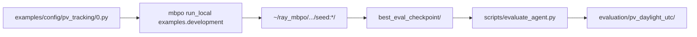

# Model-Based Policy Optimization (MBPO) — PV solar tracking

This repository trains a **model-based RL agent** to control a **two-axis solar tracker** in a **pvlib** simulator (`PVTracking-v0`). Training uses **MBPO** (ensemble dynamics + SAC). Evaluation compares the learned policy to simple baselines on the **same UTC episode grid** as training.

**Companion docs**

| Document | Contents |
|----------|----------|
| [docs/PV_TRACKING_TIME_AND_CHECKPOINTS.md](docs/PV_TRACKING_TIME_AND_CHECKPOINTS.md) | UTC daylight grid, checkpoint protocol, eval commands |
| [docs/PV_TRACKING_OBSERVATION_REVIEW.md](docs/PV_TRACKING_OBSERVATION_REVIEW.md) | Legacy 15-D vs physical 11-D observations |

---

## 1. What this project does

- **Simulates** irradiance and panel power with pvlib at **35°N, 106°W** (configurable in `mbpo/env/pv_tracking.py`).
- **Trains** on random calendar days in 2020 with stochastic weather (`weather_source='random'`).
- **Acts** with 2-D continuous commands: tilt and azimuth rate limits per 15-minute step.
- **Optimizes** per-step reward: collected energy minus a movement penalty.
- **Evaluates** with deterministic rollouts, optional baselines (`fixed_no_motion`, `sun_tracking`), CSV logs, and summary plots.

**Primary metric for reporting:** `total_energy_kwh` per episode (not peak step reward).

---

## 2. Repository layout

### 2.1 Source code (keep)

| Path | Role |
|------|------|
| `mbpo/env/pv_tracking.py` | Gym environment, pvlib, reward, `info` timestamps |
| `mbpo/static/pv_tracking.py` | MBPO termination + cyclic obs normalization |
| `mbpo/algorithms/mbpo.py` | MBPO training loop |
| `examples/config/pv_tracking/0.py` | Training hyperparameters + env kwargs |
| `examples/development/main.py` | Ray Tune entrypoint |
| `examples/development/base.py` | Variant builder; `MAX_PATH_LENGTH_PER_DOMAIN['PVTracking']` |
| `scripts/` | Health checks, training plots, evaluation (see §7) |
| `docs/` | Time standard, observation notes |

### 2.2 Generated artifacts (not in git; safe to delete and regenerate)

| Path | Produced by |
|------|-------------|
| `~/ray_mbpo/PVTracking/pv_tracking/seed:*/` | `mbpo run_local` — checkpoints, `progress.csv`, `params.json` |
| `evaluation/<run_name>/` | `scripts/evaluate_agent.py`, `compare_baselines.py` |

### 2.3 Training → evaluation data flow



---

## 3. Episode MDP (current standard)

All training, evaluation, baselines, and plots share **one** time definition. There is **no** civil-time conversion layer.

| Setting | Value |
|---------|--------|
| `tz` | `UTC` |
| `start_time` | `13:30` |
| `periods` | `40` (timestamps) |
| `freq` | `15min` |
| Env steps per episode | **39** (`periods - 1`) |
| Clock span | **13:30 → 23:15 UTC** on the episode date |
| Site default | 35°N, 106°W, 1600 m |
| Policy observations | **11-D physical** (`observation_mode='physical'`) |

**Why this grid:** At this latitude, `06:00–21:45 UTC` put ~half of winter steps in night (zero power). The daylight window keeps almost all steps in sun; expect **0–2** gray-band steps at the start in December (pre-sunrise). GHI peak on the grid is typically near **17–20 UTC** (solar noon at this longitude).

**Changing** `start_time`, `periods`, or `tz` defines a **new MDP** → retrain and re-evaluate. Old checkpoints are not comparable.

**Align these when changing horizon:**

- `environment_kwargs.periods` → `epoch_length = periods - 1`
- `examples/development/base.py` → `MAX_PATH_LENGTH_PER_DOMAIN['PVTracking']`
- Evaluation → `--max-path-length` = same step count

---

## 4. Installation

```bash
git clone --recursive https://github.com/jannerm/mbpo.git
cd mbpo
conda env create -f environment/gpu-env.yml
conda activate mbpo
pip install -e viskit
pip install -e .
```

MuJoCo is **not** required for PV tracking (only for classic MBPO benchmarks).

---

## 5. Workflow overview

Run phases **in order** for a new experiment.

| Phase | Goal | Section |
|-------|------|---------|
| **A** | Confirm env, UTC grid, config wiring | [§5.1 Health checks](#51-health-checks-dry-runs) |
| **B** | Train MBPO | [§5.2 Training](#52-training) |
| **C** | Monitor run; pick checkpoint | [§5.3 Checkpoints](#53-checkpoints) |
| **D** | Hold-out evaluation + reports | [§5.4 Post-training evaluation](#54-post-training-evaluation) |

From the repository root:

```bash
conda activate mbpo
cd mbpo   # repository root
```

---

### 5.1 Health checks (dry runs)

Run **before** a long training job. None of these modify the codebase.

| Check | Command | Pass criterion |
|-------|---------|----------------|
| Env smoke test | `python scripts/check_pv_env.py --observation-mode physical` | Reset/step OK; obs dim **11** |
| Rollout / obs scaling | `python scripts/validate_pv_rollouts.py` | Schedule matches config |
| UTC + horizon audit | `python scripts/verify_utc_uniformity.py` | Prints `ALL CHECKS PASSED`; grid **13:30**, **40** periods, **39** steps |
| pvlib vs grid | `python scripts/solar_time_sanity.py --date 2020-12-21 --env-rollout` | Peak power at post-step UTC hour with positive `solar_altitude_deg` |
| Full stack smoke | `python scripts/audit_pv_workflow.py` | Physical obs + fake env OK |
| Training wiring (no learning) | `mbpo run_example_dry examples.development --config=examples.config.pv_tracking.0 --gpus=0 --trial-gpus=0 --cpus=2 --trial-cpus=1` | Startup log shows `tz='UTC' start_time='13:30' periods=40 (39 steps)` |

Optional pvlib table for one date:

```bash
python scripts/solar_time_sanity.py --date 2020-12-21
```

---

### 5.2 Training

```bash
mbpo run_local examples.development \
  --config=examples.config.pv_tracking.0 \
  --gpus=0 --trial-gpus=0 \
  --cpus=2 --trial-cpus=1
```

**What happens each epoch**

1. Sample a random day in `[start_date, end_date]` and build weather for that day.
2. Collect **39** real transitions per episode (`epoch_length`).
3. Train ensemble dynamics; generate short model rollouts; update SAC.
4. Periodically evaluate in-env; update `best_eval_checkpoint/` when `evaluation/return-average` improves.
5. Save `checkpoint_<epoch>/` and `latest_checkpoint/`.

**Config file:** `examples/config/pv_tracking/0.py` (edit `n_epochs`, dates, `movement_penalty`, etc.). Production runs often use `n_epochs` ≥ 150; the file may be set lower for quick tests.

**Ray output directory** (from `log_dir` + `exp_name` in config):

```text
~/ray_mbpo/PVTracking/pv_tracking/seed:<id>_<timestamp><hash>/
├── progress.csv
├── params.json
├── best_eval_checkpoint/
├── checkpoint_*/
└── latest_checkpoint/
```

---

### 5.3 Checkpoints

**Resolve the trial directory**

```bash
export TRIAL=$(ls -td ~/ray_mbpo/PVTracking/pv_tracking/seed:*/ | head -1)
export TRIAL="${TRIAL%/}"
export CKPT="$TRIAL/best_eval_checkpoint"
ls "$TRIAL/progress.csv" "$TRIAL/params.json" "$CKPT"
```

**Monitor training**

```bash
python scripts/plot_training_progress.py "$TRIAL"
# or: python scripts/plot_training_progress.py latest
tail -30 "$TRIAL/progress.csv"
```

| Checkpoint | Use |
|------------|-----|
| `best_eval_checkpoint/` | Default — best training-time eval return |
| `checkpoint_<N>/` | Compare a specific epoch |
| `latest_checkpoint/` | Resume / debug only |

**Hold-out ranking (energy, not training return)**

```bash
python scripts/select_best_checkpoint.py "$TRIAL" \
  --deterministic \
  --compare-baselines \
  --fixed-eval-dates 2020-12-07,2020-12-14,2020-12-21,2020-12-28 \
  --num-rollouts 4 \
  --max-path-length 39
```

Use the printed “Recommended for reporting” path, or `best_eval_checkpoint` if it wins on **total_energy_kwh**.

---

### 5.4 Post-training evaluation

**Required for comparable results**

- `--max-path-length 39` (must match `periods - 1`)
- `--eval-protocol inherit` (forces the same UTC daylight grid as training)
- `--deterministic` for reporting

**Canonical output directory name:** `evaluation/pv_daylight_utc` (daylight grid, current MDP).

#### Run type 1 — Standard hold-out (recommended)

Fixed December dates; learned policy + baselines; full reports and plots.

```bash
python scripts/evaluate_agent.py "$CKPT" \
  --outdir evaluation/pv_daylight_utc \
  --eval-protocol inherit \
  --max-path-length 39 \
  --num-rollouts 10 \
  --deterministic \
  --compare-baselines \
  --fixed-eval-dates 2020-12-07,2020-12-14,2020-12-21,2020-12-28
```

#### Run type 2 — Random days over the training year

```bash
python scripts/evaluate_agent.py "$CKPT" \
  --outdir evaluation/pv_random_2020 \
  --eval-protocol inherit \
  --max-path-length 39 \
  --num-rollouts 10 \
  --deterministic \
  --compare-baselines
```

#### Run type 3 — Hold-out date range (e.g. all of December)

```bash
python scripts/evaluate_agent.py "$CKPT" \
  --outdir evaluation/pv_holdout_dec2020 \
  --eval-protocol inherit \
  --max-path-length 39 \
  --num-rollouts 10 \
  --deterministic \
  --compare-baselines \
  --test-start-date 2020-12-01 \
  --test-end-date 2020-12-31
```

#### Run type 4 — Seasonal solstice / equinox dates

```bash
python scripts/evaluate_agent.py "$CKPT" \
  --outdir evaluation/pv_seasonal_2020 \
  --eval-protocol inherit \
  --max-path-length 39 \
  --num-rollouts 4 \
  --deterministic \
  --compare-baselines \
  --fixed-eval-dates 2020-03-21,2020-06-21,2020-09-22,2020-12-21
```

#### Run type 5 — Clearsky weather only

```bash
python scripts/evaluate_agent.py "$CKPT" \
  --outdir evaluation/pv_clearsky_holdout \
  --eval-protocol inherit \
  --max-path-length 39 \
  --num-rollouts 10 \
  --deterministic \
  --compare-baselines \
  --eval-weather-source clearsky \
  --fixed-eval-dates 2020-12-07,2020-12-14,2020-12-21,2020-12-28
```

#### Run type 6 — Baselines only (no neural policy forward pass)

```bash
python scripts/compare_baselines.py "$CKPT" \
  --outdir evaluation/pv_baselines_only \
  --eval-protocol inherit \
  --max-path-length 39 \
  --num-rollouts 10 \
  --deterministic \
  --fixed-eval-dates 2020-12-07,2020-12-14,2020-12-21,2020-12-28
```

#### Run type 7 — Regenerate one rollout figure from CSV

```bash
python scripts/plot_rollout_trajectory.py \
  --csv evaluation/pv_daylight_utc/rollouts/rollout_1.csv \
  --outdir evaluation/pv_daylight_utc/rollout_plots_replot
```

`plot_rollout_trajectory.py` produces a **simple** 4-panel plot. The **rich** 6-panel UTC plot (power, energy, tilt, azimuth, actions, reward + night bands) is written only by `evaluate_agent.py`.

---

## 6. Evaluation outputs (essential vs optional)

Each `evaluate_agent.py` run creates a directory (e.g. `evaluation/pv_daylight_utc/`).

### 6.1 Essential (keep one canonical run for papers / reports)

| Artifact | Role |
|----------|------|
| `evaluation_summary.txt` / `.json` | Mean reward, **total_energy_kwh**, movement, season breakdown |
| `eval_scenario_confirmation.txt` | Fairness: same dates, seeds, UTC grid, baselines |
| `reward_time_analysis.txt` | Peak power/reward UTC hours; solar-altitude aggregates |
| `evaluation_method_comparison.png` | Policy vs baselines (requires `--compare-baselines`) |
| `evaluation_reward_by_solar_altitude.png` | Physics windows (preferred for “midday sun”) |
| `rollouts/rollout_<n>.csv` | Per-step `clock_hour_utc`, `power_w`, `solar_altitude_deg`, actions |

### 6.2 Useful but regenerable

| Artifact | Notes |
|----------|--------|
| `evaluation_reward_by_time_window.png` | UTC clock bins on this grid |
| `evaluation_rewards.png` | Per-rollout reward bars |
| `evaluation_by_season.png` | Skipped with `--no-report-by-season` |
| `rollout_plots/rollout_<n>_combined.png` | Large; regenerable from CSV via `evaluate_agent.py` |
| `baseline_rollouts/**/*.csv` | Regenerable with `--compare-baselines` |

### 6.3 Plot interpretation (UTC only)

- X-axis: **`clock_hour_utc`** (post-step wall clock in UTC).
- Gray bands: **`solar_altitude_deg ≤ 0`** (night / below horizon).
- Peak power often near **17–20 UTC** in winter on this grid = solar noon at 106°W, not “evening” in local civil time.
- Do **not** use peak step reward as the main metric; use **total_energy_kwh**.

---

## 7. Scripts reference

| Script | Phase | Purpose |
|--------|-------|---------|
| `check_pv_env.py` | A | Env shapes, optional `--log-obs`, `--validate-weather` |
| `validate_pv_rollouts.py` | A | MBPO rollout schedule vs config |
| `verify_utc_uniformity.py` | A, D | End-to-end UTC grid + plot axis audit |
| `solar_time_sanity.py` | A, D | pvlib sunrise/GHI vs episode grid |
| `audit_pv_workflow.py` | A | Physical obs + dynamics smoke test |
| `evaluate_agent.py` | D | Full evaluation pipeline |
| `compare_baselines.py` | D | Baselines only |
| `select_best_checkpoint.py` | C | Rank checkpoints by hold-out energy |
| `plot_training_progress.py` | B, C | Curves from `progress.csv` |
| `plot_rollout_trajectory.py` | D | Re-plot one CSV (simple layout) |
| `pv_trial_paths.py` | C | Resolve `latest` trial path (library) |
| `export_policy_weights.py` | — | Legacy checkpoint weight export |
| `plot_ray_results.py` | B | Ray resource logs |
| `evaluate_and_viskit.py` | D | Evaluation + optional viskit |

---

## 8. Configuration reference

**Training:** `examples/config/pv_tracking/0.py`

| Parameter | Default | Meaning |
|-----------|---------|---------|
| `n_epochs` | (see file) | Training epochs; increase for convergence |
| `epoch_length` | `39` | Real env steps per epoch |
| `n_initial_exploration_steps` | `390` | `≈ 10 × epoch_length` |
| `observation_mode` | `physical` | 11-D obs (legacy 15-D needs old checkpoints) |
| `start_date` / `end_date` | 2020 full year | Training day pool |
| `weather_source` | `random` | Stochastic clouds for training |
| `movement_penalty` | `0.0001` | Motion cost weight |

**Reward** (`mbpo/env/pv_tracking.py`):

```text
energy_kwh     = power_W × (15 min in hours) / 1000
movement_cost  = movement_penalty × (|Δtilt|/max_Δtilt + |Δazimuth|/max_Δazimuth)
reward         = energy_kwh - movement_cost
```

---

## 9. Evaluation directory policy

**On disk (local):** keep one canonical run:

```text
evaluation/
├── .gitkeep
└── pv_daylight_utc/          # full hold-out eval (current UTC daylight MDP)
    ├── evaluation_summary.txt
    ├── eval_scenario_confirmation.txt
    ├── reward_time_analysis.txt
    ├── evaluation_*.png
    ├── rollouts/
    ├── rollout_plots/
    └── baseline_rollouts/
```

New runs use a **new** `--outdir` name (e.g. `evaluation/pv_random_2020`). Delete old folders when finished so only `pv_daylight_utc` remains for day-to-day work.

**In git:** `evaluation/*` is ignored except `evaluation/.gitkeep` (see `.gitignore`). Checkpoints stay under `~/ray_mbpo/…`, not in the repo.

**Optional space savings** inside `pv_daylight_utc` (regenerable):

| Remove | Regenerate with |
|--------|-----------------|
| `rollout_plots/*.png` | `evaluate_agent.py` (same `--outdir`) |
| `baseline_rollouts/` | `--compare-baselines` or full `evaluate_agent.py` |

---

## 10. Quick command reference

```bash
conda activate mbpo
cd mbpo

# --- Phase A ---
python scripts/verify_utc_uniformity.py
python scripts/check_pv_env.py --observation-mode physical

# --- Phase B ---
mbpo run_local examples.development --config=examples.config.pv_tracking.0 \
  --gpus=0 --trial-gpus=0 --cpus=2 --trial-cpus=1

# --- Phase C ---
export TRIAL=$(ls -td ~/ray_mbpo/PVTracking/pv_tracking/seed:*/ | head -1)
export TRIAL="${TRIAL%/}"
export CKPT="$TRIAL/best_eval_checkpoint"
python scripts/plot_training_progress.py "$TRIAL"

# --- Phase D ---
python scripts/evaluate_agent.py "$CKPT" \
  --outdir evaluation/pv_daylight_utc \
  --eval-protocol inherit \
  --max-path-length 39 \
  --num-rollouts 10 \
  --deterministic \
  --compare-baselines \
  --fixed-eval-dates 2020-12-07,2020-12-14,2020-12-21,2020-12-28
```

---

## 11. Extending to other environments

1. Add `mbpo/env/<name>.py` and register in `mbpo/env/__init__.py`.
2. Add `mbpo/static/<domain>.py` termination function.
3. Add `examples/config/<domain>/0.py`.
4. Set `MAX_PATH_LENGTH_PER_DOMAIN` in `examples/development/base.py` if episode length ≠ 1000.

---

## Reference

```bibtex
@inproceedings{janner2019mbpo,
  author = {Michael Janner and Justin Fu and Marvin Zhang and Sergey Levine},
  title = {When to Trust Your Model: Model-Based Policy Optimization},
  booktitle = {Advances in Neural Information Processing Systems},
  year = {2019}
}
```

## Acknowledgments

SAC from [softlearning](https://github.com/rail-berkeley/softlearning). Dynamics modeling from [PETS](https://github.com/kchua/handful-of-trials).
